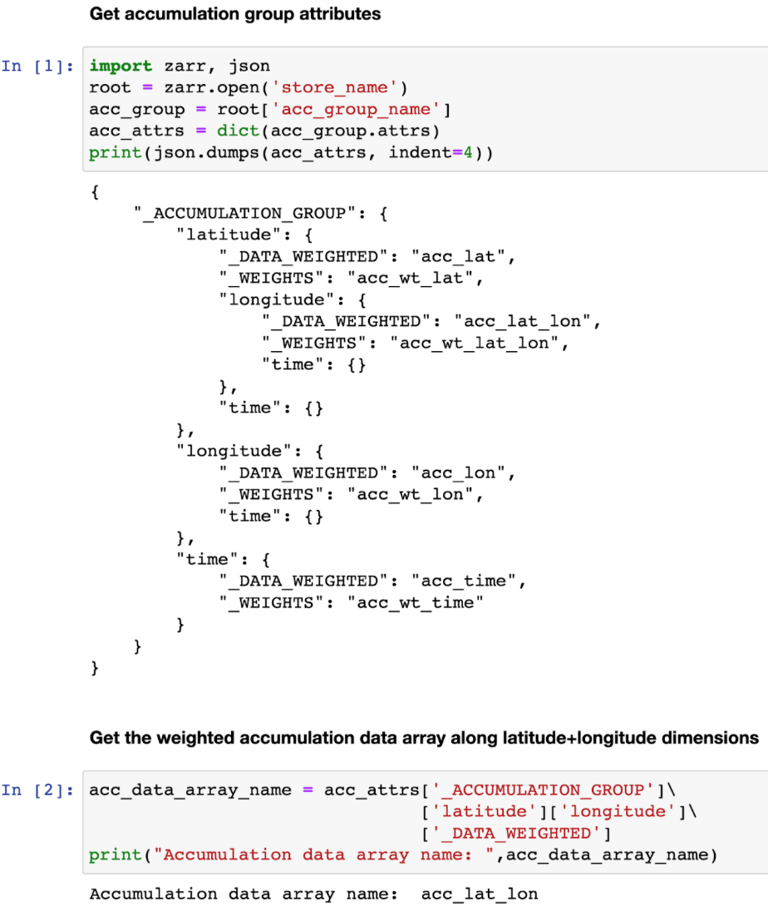
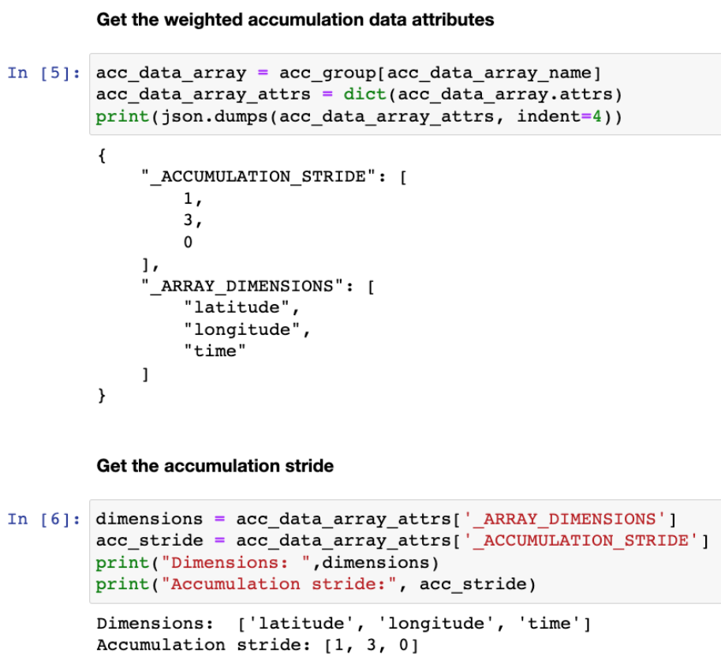

==========================================
Zarr-based Chunk-level Accumulation in Reduced Dimensions (version 1.0)
==========================================

  **Editor's draft 12 02 2023**

Specification URI:
    https://purl.org/zarr/spec/extensions/zarr-accumulation/1.0

Corresponding ZEP:
    `ZEP 5 — Zarr-based Chunk-level Accumulation in Reduced Dimensions <https://zarr.dev/zeps/draft/ZEP0005.html>`_

Suggest an edit for this spec:
    `GitHub editor <https://github.com/zarr-developers/zarr-specs/blob/main/docs/extensions/zarr-accumulation/v1.0.rst>`_

This proposal is licensed under the Apache License, Version 2.0.

----

Abstract
========

At NASA GES DISC, we receive a large number of user requests each day for a variety of analysis and visualization services involving averaging along one or more dimensions, some of which are computationally expensive when running against large amounts of geospatial data. We proposed a generic and dimension-agnostic method based on chunk-level cumulative sums (accumulation) on a regular grid, which provides fast and cost-efficient cloud analysis for multidimensional averaging services. This method introduces a small adjustable set of auxiliary data on top of the raw data, and dramatically reduces the computational time by orders of magnitude based on chunk-level accumulation along one or more dimensions.

We hereby propose a Zarr extension for this chunk-level accumulation approach. In this proposal, we will present a Zarr group for the accumulation data, a JSON schema for the accumulation group attribute, a JSON schema for the accumulation data array attribute, and an example of the user application interface.

Status of this document
=======================

.. warning::
    This document is a draft for review and subject to changes.

Motivation
==========

At NASA GES DISC, our use case is for computing averages along a range of data dimensions (e.g., space, time) in a cost effective and highly performant manner. In the Geo-spatial community, computing area or temporal averages over a long range of observations is popular with users. Performing the averaging operation over data in Zarr generally requires a full scan of the data. This can be parallelized with Dask (or any other distributed framework), but reading all of the data is an unavoidable bottleneck. Our proposed approach, Zarr-based Chunk-level Accumulation, will improve the speed and cost of long-range calculation by loading only a few data chunks at the averaging boundary. Here, we provide examples of how the approach is applied to geospatial data with temporal and spatial dimensions; however, it’s noteworthy that this approach is dimension-agnostic and can be generalized for all types of multidimensional data aggregation services with Zarr.

Document conventions
====================

Conformance requirements are expressed with a combination of descriptive
assertions and [RFC2119]_ terminology. The key words "MUST", "MUST NOT",
"REQUIRED", "SHALL", "SHALL NOT", "SHOULD", "SHOULD NOT", "RECOMMENDED", "MAY",
and "OPTIONAL" in the normative parts of this document are to be interpreted as
described in [RFC2119]_. However, for readability, these words do not appear in
all uppercase letters in this specification.

All of the text of this specification is normative except sections explicitly
marked as non-normative, examples, and notes. Examples in this specification are
introduced with the words "for example".

Detailed description
==================================

The fundamental of this Zarr-based Chunk-level Accumulation algorithm is to pre-compute `cumulative sums <https://mathworld.wolfram.com/CumulativeSum.html>`_ of data values and weights/counts along data dimensions at the chunk intervals. These cumulative sums can then be used to find data averages for dimension ranges. 

Example:

For a sequence `A=(a, b, c, d)`, the cumulative sums are `S=(s0, s1, s2, s3)` where `s0=a, s1=a+b, s2=a+b+c, s3=a+b+c+d`. The average of the sequence over a range can now be calculated using the cumulative sums. For example, assuming zero-based indexing, average `(A[1:])=(S[3]-S[0])/3=(s3-s0)/3`.

The above example can be extended and generalized for multiple dimensions. This makes the problem of computing averages *O(1)* vs *O(N^m)* for the dimensions being averaged, where *N* is the number of data values and *m* is the number of dimensions to be averaged. See our `ESIP 2022 presentation <https://www.youtube.com/watch?v=ac_UKunUrNM&t=2250s>`_ (and the `slides <https://docs.google.com/presentation/d/1RNvkIlCFvtoy89OTMzQNn_0jixOpdhnu/edit?usp=sharing&ouid=106287227661991623566&rtpof=true&sd=true>`_) for a more detailed description.

Implementation
==================================

We propose to formalize this Zarr-based Chunk-level Accumulation approach as a Zarr extension.  To implement this approach, cumulative sums are computed at chunk intervals and are stored in a Zarr group. The API for averaging the data fetches the necessary pre-computed sums based on the user-requested dimensions (e.g., time)  and dimension ranges (e.g., from 1980 to 1990).

Please note that this solution is also applicable for storing chunk statistics (min, max, sum, count, etc.) to help with performing aggregations.

Zarr group structure of accumulation data
--------------------------

Rather than storing the chunk-level statistics in a separate store, we could store them inline with the arrays they are derived from. This would enable other applications to take advantage of such pre-computed data to optimize queries. This is similar to an optimization in Snowflake (`twitter link <https://twitter.com/teej_m/status/1546591452750159873>`_).

The accumulation datasets are organized in a data group adjacent to the raw data and dimension arrays with the following structure: ::

    ├── ${dimension_array}
    ├── ...
    ├── ${raw_dataset}
    ├── ...
    └── ${raw_dataset}_accumulation_group
        ├── .zgroup
        ├── .zattr
        ├── ${accumulation_dataset_1}
        │   ├── .zarray
        │   ├── .zattr
        │   └── ...
        ├── ${accumulation_dataset_2}
        │   ├── .zarray
        │   ├── .zattr
        │   └── ...
        ...

where ``${dimension_array}`` is the data array for the dimension variable, ``${raw_dataset}`` is the data array for the raw dataset, ``${raw_dataset}_accumulation_group`` is the group for accumulation, and ``${accumulation_dataset_1}`` and ``${accumulation_dataset_2}`` are the data arrays for each accumulation dataset.

Zarr attribute file of accumulation group
--------------------------

The accumulation group attribute file, ``${raw_dataset}_accumulation_group/.zattr``, provides details of the accumulation implementation and data organization. It follows the JSON schema shown below: ::

    {
        "$schema": "http://json-schema.org/draft-07/schema#",
        "type": "object",
        "definitions": {
            "accumulation_data_array": {
                "type": "object",
                "properties": {
                    "_DATA_UNWEIGHTED": {
                        "type": "string"
                    },
                    "_DATA_WEIGHTED": {
                        "type": "string"
                    },
                    "_WEIGHTS": {
                        "type": "string"
                    }
                },
                "patternProperties": {
                    "^(?!_DATA_UNWEIGHTED|_DATA_WEIGHTED|_WEIGHTS).*$": {
                        "$ref": "#/definitions/accumulation_data_array"
                    }
                },
                "additionalProperties": false
            }
        },
        "properties": {
            "_ACCUMULATION_GROUP": {
                "type": "object",
                "patternProperties": {
                    "^(?!_DATA_UNWEIGHTED|_DATA_WEIGHTED|_WEIGHTS).*$": {
                        "$ref": "#/definitions/accumulation_data_array"
                    }
                },
                "additionalProperties": false
            }
        },
        "required": [
            "_ACCUMULATION_GROUP"
        ]
    }

The recursive definition (``#/definitions/accumulation_data_array``) under the schema root (``_ACCUMULATION_GROUP``) provides details of the cumulative sum statistics, including the dataset names, accumulation types and dimensions.  The keys of its ``properties`` (``_DATA_UNWEIGHTED``, ``_DATA_WEIGHTED``, and ``_WEIGHTS``) indicate the cumulative sum types (for unweighted data, weighted data, and weights respectively), whereas its values give the cumulative sum dataset names.  The accumulation dimension names are saved in the keys of its ``patternProperties`` along the recursion chain; it is noteworthy that these dimension names need to be ordered to avoid ambiguity and redundancy.

An example of the above zarr attribute file is given as follows.  The data has three dimensions including *latitude*, *longitude* and *time*. The cumulative sums are computed for the weighted data (``_DATA_WEIGHTED``) and weights (``_WEIGHTS``).  If we want to provide the time-averaged map and area-averaged time series, the accumulation is only needed for the dimension combinations of *latitude*, *longitude*, *time*, and *latitude+longitude*; all other dimension combinations (e.g.  *latitude+time*, *longitude+time*, and *latitude+longitude+time*) are empty (``{}``). ::

    {
        "_ACCUMULATION_GROUP": {
            "latitude": {
                "_DATA_WEIGHTED": "acc_lat",
                "_WEIGHTS": "acc_wt_lat",
                "longitude": {
                    "_DATA_WEIGHTED": "acc_lat_lon",
                    "_WEIGHTS": "acc_wt_lat_lon",
                    "time": {}
                },
                "time": {}
            },
            "longitude": {
                "_DATA_WEIGHTED": "acc_lon",
                "_WEIGHTS": "acc_wt_lon",
                "time": {}
            },
            "time": {
                "_DATA_WEIGHTED": "acc_time",
                "_WEIGHTS": "acc_wt_time"
            }
        }
    }

Zarr attribute file of accumulation data array
--------------------------

With Zarr-based chunk-level accumulation, the cumulative sums are not necessarily computed for every single chunk.  To further reduce the computation and storage cost for the accumulation data, the cumulative sums can be computed every certain number of chunks, and we call this tunable number the *accumulation stride*.  This information is saved in the Zarr attribute file for the accumulation dataset (e.g., ``${raw_dataset}_accumulation_group/{accumulation_dataset_1}/.zattr``).

As mentioned above, the dimension labels are needed to identify the accumulation datasets.  We assume that the dimensions are defined in the attributes of the dataset as ``_ARRAY_DIMENSIONS`` as from `the xarray implementation <https://docs.xarray.dev/en/stable/internals/zarr-encoding-spec.html>`_.  In the present approach, the accumulation stride is saved in an object called ``_ACCUMULATION_STRIDE`` in parallel with ``_ARRAY_DIMENSIONS``.  The related schema segment of this attribute file is shown as follows: ::

    {
        "$schema":"http://json-schema.org/draft-07/schema#",
        "type":"object",
        "properties":{
            "_ARRAY_DIMENSIONS":{
                "type":"array",
                "items":{
                    "type":"string"
                }
            },
            "_ACCUMULATION_STRIDE":{
                "type":"array",
                "items":{
                    "type":"integer"
                }
            }
        },
        "required":[
            "_ARRAY_DIMENSIONS",
            "_ACCUMULATION_STRIDE"
        ]
    }

The ``_ARRAY_DIMENSIONS`` and ``_ACCUMULATION_STRIDE`` arrays should have the same length.  Each item in the ``_ACCUMULATION_STRIDE`` array represents the accumulation stride along the dimension from the ``_ARRAY_DIMENSIONS`` array at the same index.  The value of accumulation stride should be a non-negative integer: a positive value represents the accumulation stride as defined above, whereas a value of 0 indicates the accumulation is not performed along the given dimension.

For example, the following attribute file represents the accumulation that is performed along only the time dimension every other chunk: ::

    {
        "_ARRAY_DIMENSIONS":[
            "latitude",
            "longitude",
            "time"
        ],
        "_ACCUMULATION_STRIDE":[
            0,
            0,
            2
        ]
    }

and the following attribute file represents the accumulation that is performed along the latitude dimension for each chunk, and along longitude dimension every 3 chunks: ::

    {
        "_ARRAY_DIMENSIONS":[
            "latitude",
            "longitude",
            "time"
        ],
        "_ACCUMULATION_STRIDE":[
            1,
            3,
            0
        ]
    }

### Application Interface

The accumulation-based workflow requires the application to locate the accumulation data along certain dimensions.  The accumulation data array name for the given dimensions can be obtained from the accumulation group attributes.  The following example shows the steps to get the weighted accumulation data array name along *latitude+longitude* dimensions:

The accumulation stride is also needed to locate the accumulation data for a given chunk number.  They can be obtained from the accumulation data attributes, and the following example shows the steps to get the accumulation stride for the accumulation data along *latitude+longitude* dimensions:

References
==========

.. [RFC2119] S. Bradner. Key words for use in RFCs to Indicate
   Requirement Levels. March 1997. Best Current Practice. URL:
   https://tools.ietf.org/html/rfc2119

Change log
==========

This section is a placeholder for keeping a log of the snapshots of this
document that are tagged in GitHub and what changed between them.
