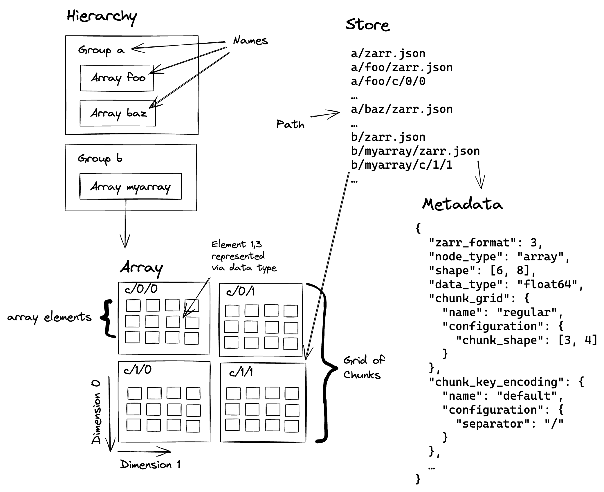

.. This file is in restructured text format: https://docutils.sourceforge.io/rst.html
.. _zarr-core-specification-v3:

=======================
Zarr core specification
=======================

Version:
    3.1
Specification URI:
    https://zarr-specs.readthedocs.io/en/latest/v3/core/

Editors:
    * Alistair Miles (`@alimanfoo <https://github.com/alimanfoo>`_), Wellcome Sanger Institute
    * Jonathan Striebel (`@jstriebel <https://github.com/jstriebel>`_), Scalable Minds
    * Norman Rzepka (`@normanrz <https://github.com/normanrz>`_), Scalable Minds
    * Jeremy Maitin-Shepard (`@jbms <https://github.com/jbms>`_), Google
    * Josh Moore (`@joshmoore <https://github.com/joshmoore>`_), German BioImaging

Corresponding ZEP:
    `ZEP0001 — Zarr specification version 3 <https://zarr.dev/zeps/accepted/ZEP0001.html>`_

Issue tracking:
    `GitHub issues <https://github.com/zarr-developers/zarr-specs/labels/core-protocol-v3.1>`_

Suggest an edit for this spec:
    `GitHub editor <https://github.com/zarr-developers/zarr-specs/blob/main/docs/v3/core/index.rst>`_

Copyright 2019-Present Zarr core development team. This work
is licensed under a `Creative Commons Attribution 3.0 Unported License
<https://creativecommons.org/licenses/by/3.0/>`_.

----

Abstract
========

This specification defines the Zarr format for N-dimensional typed arrays.

Status of this document
=======================

ZEP0001 was accepted on May 15th, 2023 via https://github.com/zarr-developers/zarr-specs/issues/227.

Introduction
============

This specification defines a format for multidimensional array data. This
type of data is common in scientific and numerical computing
applications. Many domains face computational challenges as
increasingly large volumes of data are being generated, for example,
via high resolution microscopy, remote sensing imagery, genome
sequencing or numerical simulation. The primary motivation for the
development of Zarr is to address this challenge by
enabling the storage of large multidimensional arrays in a way that is
compatible with parallel and/or distributed computing applications.

This specification supersedes the `Zarr storage
specification version 2
<https://zarr.readthedocs.io/en/stable/spec/v2.html>`_ (Zarr v2). The
Zarr v2 specification is implemented in several programming
languages and is used to store and analyse large
scientific datasets from a variety of domains. However, it has become
clear that there are several opportunities for modest but useful
improvements to be made in the format, and for establishing a foundation
that allows for greater interoperability, whilst also enabling a variety
of more advanced and specialised features to be explored and developed.

This specification also draws heavily on the `N5 API and
file-system specification <https://github.com/saalfeldlab/n5>`_, which
was developed in parallel to Zarr v2 with similar
goals and features. This specification defines a core set of features
at the intersection of both Zarr v2 and N5, and so aims to provide a
common target that can be fully implemented across multiple
programming environments and serve a wide range of applications.

We highlight the following areas motivating the
development of this specification.

Extensibility
-------------

The development of systems for storage of very large array-like data
is a very active area of research and development, and there are many
possibilities that remain to be explored. A goal of this specification
is to define a format with a number of clear extension points and
mechanisms, in order to provide a framework for freely building on and
exploring these possibilities. We aim to make this possible, whilst
also providing pathways for a graceful degradation of functionality
where possible, in order to retain interoperability. We also aim to
provide a framework for community-defined extensions, which can be
developed and published independently without requiring centralised
coordination of all specifications.

See :ref:`extension points <extensions_section>` below.

Interoperability
----------------

While the Zarr v2 and N5 specifications have each been implemented in
multiple programming languages, there is currently not feature parity
across all implementations. This is in part because the feature set
includes some features that are not easily translated or supported
across different programming languages. This specification aims to
define a set of core features that are useful and sufficient to
address a significant fraction of use cases, but are also
straightforward to implement fully across different programming
languages. Additional functionality can then be layered via
extensions, some of which may aim for wide adoption, some of which may
be more specialised and have more limited implementation.

Stability Policy
----------------

This core specification adheres to a ``MAJOR.MINOR`` version
number format. When incrementing the minor version, only additional features
can be added. Breaking changes require incrementing the major version.

A Zarr implementation that provides the read and write API by
implementing a specification ``X.Y`` can be considered compatible with all
datasets which only use features contained in version ``X.Y``.

For example, spec ``X.1`` adds core feature "foo" compared to ``X.0``. Assuming
implementation A implements ``X.1`` and implementation B implements ``X.0``.
Data using feature "foo" can only be read with implementation A. B fails to open
it, as the key "foo" is unknown.

Data not using "foo" can be used with both implementations, even if it's written
with implementation B.

Therefore, data is only marked with the respective major version, unknown
features are auto-discovered via the metadata document.

:ref:`Extensions<extensions_section>` defined in subpages of this specification
follow the same stability policy but do so with their own version number.

Document conventions
====================

Conformance requirements are expressed with a combination of
descriptive assertions and [RFC2119]_ terminology. The key words
"MUST", "MUST NOT", "REQUIRED", "SHALL", "SHALL NOT", "SHOULD",
"SHOULD NOT", "RECOMMENDED", "MAY", and "OPTIONAL" in the normative
parts of this document are to be interpreted as described in
[RFC2119]_. However, for readability, these words do not appear in all
uppercase letters in this specification.

All of the text of this specification is normative except sections
explicitly marked as non-normative, examples, and notes. Examples in
this specification are introduced with the words "for example".

Concepts and terminology
========================

This section introduces and defines some key terms and explains the
conceptual model underpinning the Zarr format.

The following figure illustrates the first part of the terminology:

..
   The following image was produced with https://excalidraw.com/
   and can be loaded there, as the source is embedded in the png.

.. _hierarchy:

*Hierarchy*

    A Zarr hierarchy is a tree structure, where each node in the tree
    is either a group_ or an array_. Group nodes may have children but
    array nodes may not. All nodes in a hierarchy have a name_ and a
    path_. The root of a Zarr hierarchy may be either a group_ or an array_.
    In the latter case, the hierarchy consists of just the single array.

.. _array:
.. _arrays:

*Array*

    An array is a node in a hierarchy_. An array is a data structure
    with zero or more dimensions_ whose lengths define the shape_ of
    the array. An array contains zero or more data elements_. All
    elements_ in an array conform to the same `data type`_. An array
    may not have child nodes.

.. _group:
.. _groups:

*Group*

    A group is a node in a hierarchy_ that may have child nodes.

.. _name:
.. _names:

*Name*

    Each child node of a group has a name, which is a string of
    characters with some additional constraints defined in the section
    on `node names`_ below.  Two sibling nodes cannot have the same
    name.

.. _path:
.. _paths:

*Path*

    Each node in a hierarchy_ has a path, a Unicode string that uniquely
    identifies the node and defines its location within the hierarchy_. The root
    node has a path of ``/``.  The path of a non-root node is equal the
    concatenation of:

    - the path of its parent node;
    - the ``/`` character, unless the parent is the root node;
    - the name_ of the node itself.

    For example, the path ``"/foo/bar"`` identifies a node named ``"bar"``,
    whose parent is named ``"foo"``, whose parent is the root of the hierarchy.

    A path always starts with ``/``, and a non-root path cannot end with ``/``,
    because node names_ must be non-empty and cannot contain ``/``.

.. _dimension:
.. _dimensions:

*Dimension*

    An array_ has a fixed number of zero or more dimensions. Each dimension has
    an integer length. This specification only considers the case where the
    lengths of all dimensions are finite. However,
    :ref:`extensions<extensions_section>` may be defined which allow a dimension
    to have an infinite or variable length.

.. _shape:

*Shape*

    The shape of an array_ is the tuple of dimension_ lengths. For
    example, if an array_ has 2 dimensions_, where the length of the
    first dimension_ is 100 and the length of the second dimension_ is
    20, then the shape of the array_ is (100, 20). A shape can be the empty
    tuple in the case of zero-dimension arrays (scalars).

.. _element:
.. _elements:

*Element*

    An array_ contains zero or more elements. Each element is
    identified by a tuple of integer coordinates, one for each
    dimension_ of the array_. If all dimensions_ of an array_ have
    finite length, then the number of elements in the array_ is given
    by the product of the dimension_ lengths.

.. _data type:

*Data type*

    A data type defines the set of possible values that an array_ may
    contain. For example, the 32-bit signed integer data type defines binary
    representations for all integers in the range −2,147,483,648 to
    2,147,483,647. This specification only defines a limited set of data types,
    but additional data types can be defined as :ref:`extensions<extensions_section>`.

.. _chunk:
.. _chunks:

*Chunk*

    An array_ is divided into a set of chunks, where each chunk is a
    hyperrectangle defined by a tuple of intervals, one for each
    dimension_ of the array_. The chunk shape is the tuple of interval
    lengths, and the chunk size (i.e., number of elements_ contained
    within the chunk) is the product of its interval lengths.

    The chunk shape elements are non-zero when the corresponding dimensions of
    the arrays have non-zero length.

.. _grid:
.. _grids:

*Grid*

    The chunks_ of an array_ are organised into a grid. This
    specification only considers the case where all chunks_ have the
    same chunk shape and the chunks form a regular grid. However,
    additional chunk grids can be defined as :ref:`extensions<extensions_section>`.

.. _codec:
.. _codecs:

*Codec*

    The list of *codecs* specified for an array_ determines the encoded byte
    representation of each chunk in the store_.

.. _metadata document:
.. _metadata documents:

*Metadata document*

    Each array_ or group_ in a hierarchy_ is represented by a metadata document,
    which is a machine-readable document containing essential
    processing information about the node. For example, an array_
    metadata document specifies the number of dimensions_, shape_,
    `data type`_, grid_, and codec_ for that array_.

.. _store:
.. _stores:

*Store*

    The `metadata documents`_ and encoded chunk_ data for all nodes in a
    hierarchy_ are held in a store as raw bytes. To enable a variety
    of different store types to be used, this specification defines an
    `Abstract store interface`_ which is a common set of operations that stores
    may provide. For example, a directory in a file system can be a Zarr store,
    where keys are file names, values are file contents, and files can be read,
    written, listed or deleted via the operating system. Equally, an S3 bucket
    can provide this interface, where keys are resource names, values are
    resource contents, and resources can be read, written or deleted via HTTP.

.. _storage transformer:
.. _storage transformers:

*Storage transformer*

    To provide performance enhancements or other optimizations,
    storage transformers may intercept and alter the storage keys and bytes
    of an array_ before they reach the underlying physical storage.
    Upon retrieval, the original keys and bytes are restored within the
    transformer. Any number of storage transformers can be registered and
    stacked. In contrast to codecs, storage transformers can act on the
    complete array, rather than individual chunks. See the
    `storage transformers details`_ below.

.. _`storage transformers details`: #storage-transformers-1

The following figure illustrates the codec, store and storage transformer
terminology for a use case of reading from an array:

..
   The following image was produced with https://excalidraw.com/
   and can be loaded there, as the source is embedded in the png.
.. image:: terminology-read.excalidraw.png
  :width: 600

*Extension point*

    A field in a `metadata document`_ that can be extended to allow values
    not defined in this specification.
    See :ref:`extension points <extensions_section>` below.

*Extension*

    An implementation of an extension point which can be referenced
    by :ref:`name <extension-naming>`.
    See the linked lists of extensions under :ref:`extension points <extensions_section>` below.

*Core*

    Core refers to features or concepts defined within this specification. The
    designation of a feature as core does not imply that it is mandatory for
    all implementations.

.. _stored-representation:

Stored representation
=====================

A Zarr hierarchy_ is represented by the following set of key/value entries in an
underlying store_:

- The array_ or group_ metadata document for the root of a Zarr hierarchy_ is
  stored under the key ``zarr.json``.

- The metadata document of a non-root array or group with hierarchy path ``P``
  is obtained by stripping the leading ``/`` of the path and appending
  ``/zarr.json``.  For example, the metadata document of an array or group with
  path ``/foo/bar`` is ``foo/bar/zarr.json``.

- All chunk or other data of an array is stored under the key prefix determined
  by its path.  For a root array, the key prefix is obtained from the metadata
  document key by stripping the trailing ``zarr.json``.  For example, for a root
  array, the prefix is the empty string.  For a non-root array with hierarchy
  path ``/foo/bar``, the prefix is ``foo/bar/``.

.. list-table:: Metadata Storage Key example
    :header-rows: 1

    * - Type
      - Path "P"
      - Key for Metadata at path `P`
    * - Array (Root)
      - `/`
      - `zarr.json`
    * - Group (Root)
      - `/`
      - `zarr.json`
    * - Group
      - `/foo`
      - `foo/zarr.json`
    * - Array
      - `/foo`
      - `foo/zarr.json`
    * - Group
      - `/foo/bar`
      - `foo/bar/zarr.json`
    * - Array
      - `/foo/baz`
      - `foo/baz/zarr.json`

.. list-table:: Data Storage Key example
    :header-rows: 1

    * - Path `P` of array
      - Chunk grid indices
      - Data key
    * - `/foo/baz`
      - `(1, 0)`
      - `foo/baz/c/1/0`

.. note::

   When storing a Zarr hierarchy in a filesystem-like store (e.g. the local
   filesystem or S3) as a sub-directory, it is recommended that the
   sub-directory name ends with ``.zarr`` to indicate the start of a hierarchy
   to users.

.. _metadata:

Metadata
========

This section defines the structure of metadata documents for Zarr hierarchies,
which consists of two types of metadata documents: array metadata documents, and
group metadata documents. Both types of metadata documents are stored under the
key ``zarr.json`` within the prefix of the array or group.  Each type of
metadata document is described in the following subsections.

Metadata documents are defined here using the JSON
type system defined in [RFC8259]_. In this section, the terms "value",
"number", "string" and "object" are used to denote the types as
defined in [RFC8259]_. The term "array" is also used as defined in
[RFC8259]_, except where qualified as "Zarr array". Following
[RFC8259]_, this section also describes an object as a set of
name/value pairs. This section also defines how metadata documents are
encoded for storage.

.. _array-metadata:

Array metadata
--------------

Each Zarr array in a hierarchy must have an array metadata document, named
``zarr.json``.

Mandatory
^^^^^^^^^

This document must contain a single object with the following
mandatory names:

.. _array-metadata-zarr-format:

``zarr_format``
""""""""""""""""

    An integer defining the version of the storage specification to which the
    array store adheres, must be ``3`` here.

.. _array-metadata-node-type:

``node_type``
"""""""""""""""

    A string defining the type of hierarchy node element, must be ``array``
    here.

.. _array-metadata-shape:

``shape``
"""""""""

    An array of integers providing the length of each dimension of the
    Zarr array. For example, a value ``[10, 20]`` indicates a
    two-dimensional Zarr array, where the first dimension has length
    10 and the second dimension has length 20.

.. _array-metadata-data-type:

``data_type``
"""""""""""""

    The data type of the Zarr array.

    ``data_type`` is an :ref:`extension point<extensions_section>`
    and MUST conform to the :ref:`extension-definition`.

    If the data type is defined in
    this specification, then the value must be the data type
    identifier provided as a string. For example, ``"float64"`` for
    little-endian 64-bit floating point number.

.. _array-metadata-chunk-grid:

``chunk_grid``
""""""""""""""

    The chunk grid of the Zarr array.

    ``chunk_grid`` is an :ref:`extension point<extensions_section>`
    and MUST conform to the :ref:`extension-definition`.

    If the chunk grid is a regular chunk grid
    as defined in this specification, then the value must be an object with the
    names ``name`` and ``configuration``. The value of ``name`` must be the
    string ``"regular"``, and the value of ``configuration`` an object with the
    member ``chunk_shape``. ``chunk_shape`` must be an array of
    integers providing the lengths of the chunk along each dimension of the
    array.  For example,
    ``{"name": "regular", "configuration": {"chunk_shape": [2, 5]}}``
    means a regular grid where the chunks have length 2 along the first
    dimension and length 5 along the second dimension.

.. _array-metadata-chunk-key-encoding:

``chunk_key_encoding``
""""""""""""""""""""""

    The mapping from chunk grid cell coordinates to keys in the underlying
    store.

    ``chunk_key_encoding`` is an :ref:`extension point<extensions_section>`
    and MUST conform to the :ref:`extension-definition`.

.. _array-metadata-fill-value:

``fill_value``
""""""""""""""

    Provides an element value to use for uninitialised portions of the
    Zarr array.

    The permitted values depend on the data type. Fill values for core
    data types are listed in :ref:`fill-value-list`.

    Extension data types MUST also define the JSON fill value representation.

    .. note::

       The ``fill_value`` metadata field is required, but Zarr implementations
       may provide an interface for creating a new array with which users can
       leave the fill value unspecified, in which case a default fill value for
       the data type will be chosen.  However, the default fill value that is
       chosen MUST be recorded in the metadata.

.. _array-metadata-codecs:

``codecs``
""""""""""

    Specifies a list of codecs to be used for encoding and decoding chunks.

    Each codec is an :ref:`extension point<extensions_section>`
    and MUST conform to the :ref:`extension-definition`.

    Because ``codecs`` MUST contain an ``array
    -> bytes`` codec, the list cannot be empty (See :ref:`codecs <codecs>`).

Optional
^^^^^^^^

The following members are optional:

.. _array-metadata-attributes:

``attributes``
""""""""""""""

    The value must be an object. The object may contain any key/value
    pairs, where the key must be a string and the value can be an arbitrary
    JSON literal. Intended to allow storage of arbitrary user metadata.

  .. note::
    An extension to store user attributes in a separate document is being
    discussed in https://github.com/zarr-developers/zarr-specs/issues/72.

  .. note::
    A proposal to specify metadata conventions (ZEP 4) is being discussed in
    https://github.com/zarr-developers/zeps/pull/28.

.. _array-metadata-storage-transformers:

``storage_transformers``
""""""""""""""""""""""""

    Specifies a list of `storage transformers`_.

    Each storage transformer is an :ref:`extension point<extensions_section>`
    and MUST conform to the :ref:`extension-definition`.

    When the ``storage_transformers`` name is
    absent no storage transformer is used, same for an empty list.

.. _array-metadata-dimension-names:

``dimension_names``
"""""""""""""""""""

    Specifies dimension names, e.g. ``["x", "y", "z"]``.  If specified, must be
    an array of strings or null objects with the same length as ``shape``.  An
    unnamed dimension is indicated by the null object.  If ``dimension_names`` is
    not specified, all dimensions are unnamed.

    For compatibility with Zarr implementations and applications that support
    using dimension names to uniquely identify dimensions, it is recommended but
    not required that all non-null dimension names are distinct (no two
    dimensions have the same non-empty name).

    This specification also does not place any restrictions on the use of the
    same dimension name across multiple arrays within the same Zarr hierarchy,
    but extensions or specific applications may do so.

.. _array-metadata-extensions:

Unknown
^^^^^^^

All other keys found in the metadata object MUST be interpreted
following the :ref:`Extensions section <extensions_section>`.

Example
^^^^^^^

For example, the array metadata JSON document below defines a
two-dimensional array of 64-bit little-endian floating point numbers,
with 10000 rows and 1000 columns, divided into a regular chunk grid where
each chunk has 1000 rows and 100 columns, and thus there will be 100
chunks in total arranged into a 10 by 10 grid. Within each chunk the
binary values are laid out in C contiguous order. Each chunk is
compressed using gzip compression prior to storage::

    {
        "zarr_format": 3,
        "node_type": "array",
        "shape": [10000, 1000],
        "dimension_names": ["rows", "columns"],
        "data_type": "float64",
        "chunk_grid": {
            "name": "regular",
            "configuration": {
                "chunk_shape": [1000, 100]
            }
        },
        "chunk_key_encoding": {
            "name": "default",
            "configuration": {
                "separator": "/"
            }
        },
        "codecs": [{
            "name": "bytes",
            "configuration": {
                "endian": "little"
            }
        }],
        "fill_value": "NaN",
        "attributes": {
            "foo": 42,
            "bar": "apples",
            "baz": [1, 2, 3, 4]
        }
    }

The following example illustrates an array with the same shape and chunking as
above, but using a (currently made up) extension data type::

    {
        "zarr_format": 3,
        "node_type": "array",
        "shape": [10000, 1000],
        "data_type": {
            "name": "datetime",
            "configuration": {
                "unit": "ns"
            }
        },
        "chunk_grid": {
            "name": "regular",
            "configuration": {
                "chunk_shape": [1000, 100]
            }
        },
        "chunk_key_encoding": {
            "name": "default",
            "configuration": {
                "separator": "/"
            }
        },
        "codecs": [{
            "name": "bytes",
            "configuration": {
                "endian": "big"
            }
        }],
        "fill_value": null,
    }

.. note::

   Comparison with Zarr spec v2:

   - ``dtype`` has been renamed to ``data_type``,
   - ``chunks`` has been replaced with ``chunk_grid``,
   - ``dimension_separator`` has been replaced with ``chunk_key_encoding``,
   - ``order`` has been replaced by the :ref:`transpose <transpose-codec-v1>` codec,
   - the separate ``filters`` and ``compressor`` fields been combined into the single ``codecs`` field.

.. _group-metadata:

Group metadata
--------------

Mandatory
^^^^^^^^^

A Zarr group metadata object must contain the following mandatory key:

``zarr_format``
"""""""""""""""

    An integer defining the version of the storage specification to which the
    array store adheres, must be ``3`` here.

``node_type``
"""""""""""""""

    A string defining the type of hierarchy node element, must be ``group``
    here.

Optional
^^^^^^^^

Optional keys:

``attributes``
""""""""""""""

    The value must be an object. The object may contain any key/value
    pairs, where the key must be a string and the value can be an arbitrary
    JSON literal. Intended to allow storage of arbitrary user metadata.

Unknown
^^^^^^^

All other keys found in the metadata object MUST be interpreted
following the :ref:`Extensions section <extensions_section>`.

Example
^^^^^^^

For example, the JSON document below defines a group::

    {
        "zarr_format": 3,
        "node_type": "group",
        "attributes": {
            "spam": "ham",
            "eggs": 42
        }
    }

The group metadata object must not contain any other names. Those are reserved
for future versions of this specification. An implementation must fail to open
zarr hierarchies or groups with unknown metadata fields, with the exception of
objects with a ``"must_understand": false`` key-value pair.
See :ref:`extension-definition-must-understand` for more information.

Node names
==========

The root node does not have a name and is the empty string ``""``.
Except for the root node, each node in a hierarchy must have a name,
which is a string of unicode code points. The following constraints
apply to node names:

* must not be the empty string (``""``)
* must not include the character ``"/"``
* must not be a string composed only of period characters, e.g. ``"."`` or ``".."``
* must not start with the reserved prefix ``"__"``

To ensure consistent behaviour across different storage systems and programming
languages, we recommend users to only use characters in the sets ``a-z``,
``A-Z``, ``0-9``, ``-``, ``_``, ``.``.

Node names are case sensitive, e.g., the names "foo" and "FOO" are **not**
identical.

When using non-ASCII Unicode characters, we recommend users to use
case-folded NFKC-normalized strings following the
`General Security Profile for Identifiers of the Unicode Security Mechanisms (Unicode Technical Standard #39) <http://www.unicode.org/reports/tr39/#General_Security_Profile>`_.
This follows the
`Recommendations for Programmers (B) of the Unicode Security Considerations (Unicode Technical Report #36) <https://unicode.org/reports/tr36/#Recommendations_General>`_.

.. note::
    A storage transformer for unicode normalization might be added later, see
    https://github.com/zarr-developers/zarr-specs/issues/201.

.. note::
    The underlying store might pose additional restriction on node names,
    such as the following:

    * `260 characters path length limit in Windows <https://learn.microsoft.com/en-us/windows/win32/fileio/maximum-file-path-limitation>`_
    * 1,024 bytes UTF8 object key limit for
      `AWS S3 <https://docs.aws.amazon.com/AmazonS3/latest/userguide/object-keys.html>`_
      and `GCS <https://cloud.google.com/storage/docs/objects#naming>`_, with
      additional constraints.
    * `Windows paths are case-insensitive by default <https://learn.microsoft.com/en-us/windows/win32/fileio/naming-a-file#naming-conventions>`_
    * `MacOS paths are case-insensitive by default <https://support.apple.com/guide/disk-utility/file-system-formats-dsku19ed921c/mac>`_

.. note::
    If a store requires an explicit byte string representation the default
    representation is the ``UTF-8`` encoded Unicode string.

.. note::
    The prefix ``__zarr`` is reserved for core Zarr data, and extensions
    can use other files and folders starting with ``__``.

Data types
==========

A data type describes the set of possible binary values that an array
element may take, along with some information about how the values
should be interpreted.

This specification defines a limited set of data types to
represent boolean values, integers, and floating point
numbers. These can be found under :ref:`Data Types<data-type-list>`.

All of the data types defined here have a fixed size, in the sense that all values
require the same number of bytes.

Additional data types may be defined as :ref:`extensions<extensions_section>`
which MAY have variable sized data types.

Note that the Zarr specification is intended to enable communication
of data between a variety of computing environments. The native byte
order may differ between machines used to write and read the data.

Each data type is associated with an identifier, which can be used in
metadata documents to refer to the data type. For the data types
defined in this specification, the identifier is a simple ASCII
string. However, extensions may use any JSON value to identify a data
type.

In addition to these base types, an implementation should also handle the
raw/opaque pass-through type designated by the lower-case letter ``r`` followed
by the number of bits, multiple of 8. For example, ``r8``, ``r16``, and ``r24``
should be understood as fall-back types of respectively 1, 2, and 3 byte length.

Zarr v3 is limited to type sizes that are a multiple of 8 bits but may support
other type sizes in later versions of this specification.

.. note::

    We are explicitly looking for more feedback and prototypes of code using the ``r*``,
    raw bits, for various endianness and whether the spec could be made clearer.

.. note::

    Currently only fixed size elements are supported as a core data type.
    There are many requests for variable length element encoding. There are many
    ways to encode variable length and we want to keep flexibility. While we seem
    to agree that for random access the most likely contender is to have two
    arrays, one with the actual variable length data and one with fixed size
    (pointer + length) to the variable size data, we do not want to commit to such
    a structure.
    See https://github.com/zarr-developers/zarr-specs/issues/62.

Chunk grids
===========

A chunk grid defines a set of chunks which contain the elements of an
array. The chunks of a grid form a tessellation of the array space,
which is a space defined by the dimensionality and shape of the
array. This means that every element of the array is a member of one
chunk, and there are no gaps or overlaps between chunks.

In general there are different possible types of grids. Those defined
under the core specification can be found under :ref:`chunk-grid-list`.
Additional grid types MAY be defined as :ref:`extensions<extensions_section>`,
such as rectilinear grids where chunks are still
hyperrectangles but do not all share the same shape.

A grid type must also define rules for constructing an identifier for
each chunk that is unique within the grid, which is a string of ASCII
characters that can be used to construct keys to save and retrieve
chunk data in a store, see also the `Storage`_ section.

Chunk encoding
==============

Chunks are encoded into a binary representation for storage in a store_, using
the chain of codecs_ specified by the ``codecs`` metadata field.

Codecs
------

An array_ has an associated list of *codecs*.  Each codec specifies a
bidirectional transform (an *encode* transform and a *decode* transform).

Each codec has an *encoded representation* and a *decoded representation*;
each of these two representations are defined to be either:

- a multi-dimensional array of some shape and data type, or
- a byte string.

Based on the input and output representations for the encode transform,
codecs can be classified as one of three kinds:

- ``array -> array``
- ``array -> bytes``
- ``bytes -> bytes``

.. note::

   ``bytes -> array`` codecs, where after encoding an array as a byte
   string, it is subsequently transformed back into an array, to then later
   be transformed back into a byte string, are not currently allowed, due to
   the lack of a clear use case.

If multiple codecs are specified for an array, each codec is applied
sequentially; when encoding, the encoded output of codec ``i`` serves as the
decoded input of codec ``i+1``, and similarly when decoding, the decoded output
of codec ``i+1`` serves as the encoded input to codec ``i``.  Since ``bytes ->
array`` codecs are not supported, it follows that the list of codecs must be of
the following form:

- zero or more ``array -> array`` codecs; followed by
- exactly one ``array -> bytes`` codec; followed by
- zero or more ``bytes -> bytes`` codecs.

Logically, a codec ``c`` must define three properties:

- ``c.compute_encoded_representation_type(decoded_representation_type)``, a
  procedure that determines the encoded representation based on the decoded
  representation and any codec parameters.  In the case of a decoded
  representation that is a multi-dimensional array, the shape and data type
  of the encoded representation must be computable based only on the shape
  and data type, but not the actual element values, of the decoded
  representation.  If the ``decoded_representation_type`` is not supported,
  this algorithm must fail with an error.

- ``c.encode(decoded_value)``, a procedure that computes the encoded
  representation, and is used when writing an array.

- ``c.decode(encoded_value, decoded_representation_type)``, a procedure that
  computes the decoded representation, and is used when reading an array.

Implementations MAY support partial decoding for certain codecs
(e.g. sharding, blosc).  Logically, partial decoding may be defined in terms
of an additional operation:

- ``c.partial_decode(input_handle, decoded_representation_type,
  decoded_regions)``, where:

  - ``input_handle`` provides an interface for requesting partial reads of
    the encoded representation and itself supports the same
    ``partial_decode`` interface;
  - ``decoded_representation_type`` is the same as for ``c.decode``;
  - ``decoded_regions`` specifies the regions of the decoded representation
    that must be returned.

  If the encoded representation is a multi-dimensional array, then
  ``decoded_regions`` specifies a subset of the array's domain.  If the
  encoded representation is a byte string, then ``decoded_regions``
  specifies a list of byte ranges.

- ``c.compute_encoded_size(input_size)``, a procedure that determines the 
  size of the encoded representation given a size of the decoded representation.
  This procedure cannot be implemented for codecs that produce variable-sized
  encoded representations, such as compression algorithms. Depending on the 
  type of the codec, the signature could differ:

  - ``c.compute_encoded_size(array_size, data_type) -> (array_size, data_type)`` 
    for ``array -> array`` codecs, where ``array_size`` is the number of items 
    in the array, i.e., the product of the components of the array's shape;
  - ``c.compute_encoded_size(array_size, data_type) -> byte_size`` 
    for ``array -> bytes`` codecs;
  - ``c.compute_encoded_size(byte_size) -> byte_size`` 
    for ``bytes -> bytes`` codecs.

.. note::

   If ``partial_decode`` is not supported by a particular codec, it can
   always be implemented in terms of ``decode`` by simply decoding in full
   and then satisfying any ``decoded_regions`` requests directly from the
   cached decoded representation.

Determination of encoded representations
----------------------------------------

To encode or decode a chunk, the encoded and decoded representations for each
codec in the chain must first be determined as follows:

1. The initial decoded representation, ``decoded_representation[0]`` is a
   multi-dimensional array with the same data type as the Zarr array, and shape
   equal to the chunk shape.

2. For each codec ``i``, the encoded representation is equal to the decoded
   representation ``decoded_representation[i+1]`` of the next codec, and is
   computed from
   ``codecs[i].compute_encoded_representation_type(decoded_representation[i])``.
   If ``compute_encoded_representation_type`` fails because of an incompatible
   decoded representation, an implementation should indicate an error.

.. _encoding_procedure:

Encoding procedure
------------------

Based on the computed ``decoded_representations`` list, a chunk is encoded using
the following procedure:

1. The initial *encoded chunk* ``EC[0]`` of the type specified by
   ``decoded_representation[0]`` is equal to the chunk array ``A`` (with a shape
   equal to the chunk shape, and data type equal to the Zarr array data type).

2. For each codec ``codecs[i]`` in ``codecs``, ``EC[i+1] :=
   codecs[i].encode(EC[i])``.

3. The final encoded chunk representation ``EC_final := EC[codecs.length]``.
   This is always a byte string due to the requirement that the list of codecs
   include an ``array -> bytes`` codec.

4. ``EC_final`` is written to the store_.

.. _decoding_procedure:

Decoding procedure
------------------

Based on the computed ``decoded_representations`` list, a chunk is decoded using
the following procedure:

1. The encoded chunk representation ``EC_final`` is read from the store_.

2. ``EC[codecs.length] := EC_final``.

3. For each codec ``codecs[i]`` in ``codecs``, iterating in reverse order,
   ``EC[i] := codecs[i].decode(EC[i+1], decoded_representation[i])``.

4. The chunk array ``A`` is equal to ``EC[0]``.

.. _codec-specification:

Core codecs
-----------

This specification defines a set of codecs ("core codecs") which all Zarr implementations SHOULD implement in
order to ensure a minimal level of interoperability between Zarr implementations.
The list of core codecs is part of the Zarr v3 specification.
Changes to the list of core codecs MUST be made via the same protocol used for
changing the Zarr v3 specification. Changes to the list of core codecs SHOULD be made
in close collaboration with extant Zarr v3 implementations. A new core codec SHOULD be added to the
list when a sufficient number of Zarr implementations support or intend to support that codec.
An existing core codec SHOULD be removed from the list when a sufficient number of implementation
developers and Zarr users deem the codec worth removing, e.g. because of a technical flaw in the
algorithm underlying the codec.

Extension codecs
----------------

To allow for flexibility to define and implement new codecs, the
list of codecs defined for an array MAY contain codecs which are
defined in separate specifications. In order to refer to codecs in array metadata
documents, each codec must have a unique identifier, which is either
a known "`raw name <extension-naming-raw-names>`_" or
a "`URL-based name <extension-naming-url-based-names>`_" as defined under :ref:`extensions_section`.
For ease of discovery, it is
recommended that codec specifications are contributed to the
registry of extensions
(`zarr-extensions`_).

A codec specification MUST declare the codec identifier, and describe
(or cite documents that describe) the encoding and decoding algorithms
and the format of the encoded data.
A codec MAY have configuration parameters which modify the behaviour
of the codec in some way. For example, a compression codec may have a
compression level parameter, which is an integer that affects the
resulting compression ratio of the data. Configuration parameters must
be declared in the codec specification, including a definition of how
configuration parameters are represented as JSON.

Further details of how codecs are configured for an array are given in the
`Array metadata`_ section.

Stores
======

A Zarr store is a system that can be used to store and retrieve data
from a Zarr hierarchy. For a store to be compatible with this
specification, it must support a set of operations defined in the `Abstract store
interface`_ subsection. The store interface can be implemented using a
variety of underlying storage technologies, described in the
subsection on `Store implementations`_.

Additionally, a store should specify a canonical URI format that can be used to
identify nodes in this store. Implementations should use the specified formats
when opening a Zarr hierarchy to automatically determine the appropriate store.

.. _abstract-store-interface:

Abstract store interface
------------------------

The store interface is intended to be simple to implement using a
variety of different underlying storage technologies. It is defined in
a general way here, but it should be straightforward to translate into
a software interface in any given programming language. The goal is
that an implementation of this specification could be modular and
allow for different store implementations to be used.

The store interface defines a set of operations involving `keys` and
`values`. In the context of this interface, a `key` is a Unicode
string, where the final character is **not** a ``/`` character.
In general, a `value` is a sequence of bytes. Specific stores
may choose more specific storage formats, which must be stated in the
specification of the respective store. E.g. a database store might
encode values of ``*.json`` keys with a database-native json type.

It is assumed that the store holds (`key`, `value`) pairs, with only
one such pair for any given `key`. I.e., a store is a mapping from
keys to values. It is also assumed that keys are case sensitive, i.e.,
the keys "foo" and "FOO" are different.

To read and write partial values, a `range` specifies two integers
`range_start` and `range_length`, that specify a part of the value
starting at byte `range_start` (inclusive) and having a length of
`range_length` bytes. `range_length` may be none, indicating all
available data until the end of the referenced value. For example
`range` ``[0, none]`` specifies the full value. Stores that do not
support partial access can still fulfill partial requests by first extracting
the full value and then returning a subset of bytes.

The store interface also defines some operations involving
`prefixes`. In the context of this interface, a prefix is a string
containing only characters that are valid for use in `keys` and ending
with a trailing ``/`` character.

The store operations are grouped into three sets of capabilities:
**readable**, **writeable** and **listable**. It is not necessary for
a store implementation to support all of these capabilities.

A **readable store** supports the following operations:

``get`` - Retrieve the `value` associated with a given `key`.

    | Parameters: `key`
    | Output: `value`

``get_partial_values`` - Retrieve possibly partial `values` from given `key_ranges`.

    | Parameters: `key_ranges`: ordered set of `key`, `range` pairs,
    |   a `key` may occur multiple times with different `ranges`
    | Output: list of `values`, in the order of the `key_ranges`,
    |   may contain null/none for missing keys

A **writeable store** supports the following operations:

``set`` - Store a (`key`, `value`) pair.

    | Parameters: `key`, `value`
    | Output: none

``set_partial_values`` - Store `values` at a given `key`, starting at byte `range_start`.

    | Parameters: `key_start_values`: set of `key`,
    |   `range_start`, `values` triples, a `key` may occur multiple
    |   times with different `range_starts`, `range_starts` (considering
    |   the length of the respective `values`) must not specify overlapping
    |   ranges for the same `key`
    | Output: none

``erase`` - Erase the given key/value pair from the store.

    | Parameters: `key`
    | Output: none

``erase_values`` - Erase the given key/value pairs from the store.

    | Parameters: `keys`: set of `keys`
    | Output: none

``erase_prefix`` - Erase all keys with the given prefix from the store:

    | Parameter: `prefix`
    | Output: none

.. note::

   Some stores allow creating and updating keys, but not deleting them. For
   example, Zip archives do not allow removal of content without recreating the
   full archive.

   Inability to delete can impair the ability to rename keys, as a rename
   is often a sequence or atomic combination of a deletion and a creation.

A **listable store** supports any one or more of the following
operations:

``list`` - Retrieve all `keys` in the store.

    | Parameters: none
    | Output: set of `keys`

``list_prefix`` - Retrieve all keys with a given prefix.

    | Parameters: `prefix`
    | Output: set of `keys` with the given `prefix`,

    For example, if a store contains the keys "a/b", "a/c/d" and
    "e/f/g", then ``list_prefix("a/")`` would return "a/b" and "a/c/d".

    Note: the behaviour of ``list_prefix`` is undefined if ``prefix`` does not end
    with a trailing slash ``/`` and the store can assume there is at least one key
    that starts with ``prefix``.

``list_dir`` - Retrieve all keys and prefixes with a given prefix and
which do not contain the character "/" after the given prefix.

    | Parameters: `prefix`
    | Output: set of `keys` and set of `prefixes`

    For example, if a store contains the keys "a/b", "a/c", "a/d/e",
    "a/f/g", then ``list_dir("a/")`` would return keys "a/b" and "a/c"
    and prefixes "a/d/" and "a/f/". ``list_dir("b/")`` would return
    the empty set.

Note that because keys are case sensitive, it is assumed that the
operations ``set("foo", a)`` and ``set("FOO", b)`` will result in two
separate (key, value) pairs being stored. Subsequently ``get("foo")``
will return *a* and ``get("FOO")`` will return *b*.

It is recommended that the implementation of the
``get_partial_values``, ``set_partial_values`` and
``erase_values`` methods is made optional, providing fallbacks
for them by default. However, it is recommended to supply those operations
where possible for efficiency. Also, the ``get``, ``set`` and ``erase``
can easily be mapped onto their `partial_values` counterparts.
Therefore, it is also recommended to supply fallbacks for those if the
`partial_values` operations can be implemented.
An entity containing those fallbacks could be named ``StoreWithPartialAccess``.

Store implementations
---------------------

(This subsection is not normative.)

A store implementation maps the abstract operations of the store
interface onto concrete operations on some underlying storage
system. This specification does not constrain or make any assumptions
about the nature of the underlying storage system. Thus it is possible
to implement the store interface in a variety of different ways.

For example, a store implementation might use a conventional file
system as the underlying storage system, mapping keys onto file paths
and values onto file contents. The ``get`` operation could then be
implemented by reading a file, the ``set`` operation implemented by
writing a file, and the ``list_dir`` operation implemented by listing
a directory.

For example, a store implementation might use a key-value database
such as BerkeleyDB or LMDB as the underlying storage system. In this
case the implementation of ``get`` and ``set`` operations would be
whatever native operations are provided by the
database for getting and setting key/value pairs. Such a store
implementation might natively support the ``list`` operation but might
not support ``list_prefix`` or ``list_dir``, although these could be
implemented via ``list`` with post-processing of the returned keys.

For example, a store implementation might use a cloud object storage
service such as Amazon S3, Azure Blob Storage, or Google Cloud Storage
as the underlying storage system, mapping keys to object names and
values to object contents. The store interface operations would then
be implemented via concrete operations of the service's REST API,
i.e., via HTTP requests. E.g., the ``get`` operation could be
implemented via an HTTP GET request to an object URL, the ``set``
operation could be implemented via an HTTP PUT request to an object
URL, and the list operations could be implemented via an HTTP GET
request to a bucket URL (i.e., listing a bucket).

The examples above are meant to be illustrative only, and other
implementations are possible. This specification does not attempt to
standardise any store implementations, however where a store
implementation is expected to be widely used then it is recommended to
create a store implementation spec and contribute it to the `zarr-specs GitHub repository`_.
For an example of a store implementation spec, see the
:ref:`file-system-store-v1` specification.

Storage
=======

This section describes how to translate high level operations to
create, erase or modify Zarr hierarchies, groups or arrays, into low
level operations on the key/value store interface defined above.

In this section a "hierarchy path" is a logical path which identifies
a group or array node within a Zarr hierarchy, and a "storage key" is
a key used to store and retrieve data via the store interface. There
is a further distinction between "metadata keys" which are storage
keys used to store metadata documents, and "chunk keys" which are
storage keys used to store encoded chunks.

Note that any non-root hierarchy path will have ancestor paths that
identify ancestor nodes in the hierarchy. For example, the path
"/foo/bar" has ancestor paths "/foo" and "/".

Operations
----------

The following section describes possible operations of an implementation as a
non-normative guide-line.

Let `P` be an arbitrary hierarchy path.

Let ``meta_key(P)`` be the metadata key for `P`, ``P/zarr.json``.

Let ``data_key(P, j, i ...)`` be the data key for `P` for the chunk
with grid coordinates (`j`, `i`, ...).

Let "+" be the string concatenation operator.

**Create a group**

    To create a group at hierarchy path `P`, perform
    ``set(meta_key(P), value)``, where `value` is the
    serialization of a valid group metadata document, and
    ensure the existence of groups at all ancestor paths of `P`.

**Create an array**

    To create an array at hierarchy path `P`, perform
    ``set(meta_key(P), value)``, where `value` is the serialisation of a valid
    array metadata document.

    Creating an array at path `P` implies the existence of groups at all
    ancestor paths of `P`.

**Store chunk data in an array**

    To store chunk data in an array at path `P` and chunk coordinate (`j`, `i`,
    ...), perform ``set(data_key(P, j, i, ...), value)``, where `value` is the
    serialisation of the corresponding chunk, encoded according to the
    information in the array metadata stored under the key ``meta_key(P)``.

**Retrieve chunk data in an array**

    To retrieve chunk data in an array at path `P` and chunk coordinate (`i`,
    `j`, ...), perform ``get(data_key(P, j, i, ...))``. The returned
    value is the serialisation of the corresponding chunk, encoded according to
    the array metadata stored at ``meta_key(P)``.

**Discover children of a group**

    To discover the children of a group at hierarchy path `P`, perform
    ``list_dir(P + "/")``. Any returned prefix ``Q`` not starting with ``__``
    indicates a child array or group. To determine whether the child is
    an array or group, the document ``meta_key(Q)`` must be checked.

    For example, if a group is created at path "/foo/bar" and an array
    is created at path "/foo/baz/qux", then the store will contain the
    keys "foo/bar/zarr.json" and "foo/baz/qux/zarr.json".
    Groups at paths "/", "/foo" and "/foo/baz" have not been explicitly
    created but are implied by their descendants. To list the children
    of the group at path "/foo", perform ``list_dir("/foo/")``,
    which will return the prefixes "foo/bar" and "foo/baz".
    From this it can be inferred that child groups or arrays
    "/foo/bar" and "/foo/baz" are present.

    If a store does not support any of the list operations then discovery of
    group children is not possible, and the contents of the hierarchy must be
    communicated by some other means, such as via an extension (see
    https://github.com/zarr-developers/zarr-specs/issues/15) or via some out of
    band communication.

**Discover all nodes in a hierarchy**

    To discover all nodes in a hierarchy, one should discover the children of
    the root of the hierarchy and then recursively list children of child
    groups.

    For hierarchies without group storage transformers one may also call
    ``list_prefix("/")``. All ``zarr.json`` keys represent either groups or arrays.

**Erase a group or array**

    To erase an array at path `P`, erase the metadata document and array data
    for the array, ``erase_prefix(P + "/")``.

    To erase a group at path `P`: erase all nodes under
    this group and its metadata document - it should be sufficient to perform
    ``erase_prefix(P + "/")``

**Determine if a node exists**

    To determine if a node exists at path ``P``, try in the following order

    - ``get(meta_key(P))``
      (success implies an array or group at ``P``);

    .. note::
        For listable stores, ``list_dir(parent(P))`` can be an alternative.

Storage transformers
====================

A Zarr storage transformer modifies a request to read or write data before passing
that request to the following transformer or store.
The stored transformed data is restored to its original state whenever data is requested
by the Array. Storage transformers can be configured per array via the
`storage_transformers <storage_transformers_>`_ name in the `array metadata`_. Storage transformers which do
not change the storage layout (e.g. for caching) may be specified at runtime without
adding them to the array metadata.

.. note::
    It is planned to add storage transformers also to groups in a later revision
    of this spec, see https://github.com/zarr-developers/zarr-specs/issues/215.

A storage transformer serves the same `abstract store interface`_ as the store_.
However, it should not persistently store any information necessary to restore the original data,
but instead propagates this to the next storage transformer or the final store.
From the perspective of an array or a previous stage transformer, both store and storage transformer follow the same
protocol and can be interchanged regarding the protocol. The behaviour can still be different,
e.g. requests may be cached or the form of the underlying data can change.

Storage transformers may be stacked to combine different functionalities:

.. mermaid::

    graph LR
      Array --> t1
      subgraph stack [Storage transformers]
        t1[Transformer 1] --> t2[...] --> t3[Transformer N]
      end
      t3 --> Store

.. _extensions_section:

Extensions
==========

This section describes how additional functionality can be defined
for Zarr datasets by the `metadata documents`_.

Extension points
----------------

Different types of extensions can exist and they can be grouped as follows:

=========== ======================= ================================================================== ================================
node_type   extension point         metadata definition                                                list of core extensions
=========== ======================= ================================================================== ================================
array       data type               :ref:`data-type <array-metadata-data-type>`                        :ref:`data-type-list`
array       chunk grid              :ref:`chunk-grid <array-metadata-chunk-grid>`                      :ref:`chunk-grid-list`
array       chunk key encoding      :ref:`chunk-key-encoding <array-metadata-chunk-key-encoding>`      :ref:`chunk-key-encoding-list`
array       codecs                  :ref:`codecs <array-metadata-codecs>`                              :ref:`codec-list`
array       storage transformer     :ref:`storage-transformers <array-metadata-storage-transformers>`  :ref:`storage-transformer-list`
=========== ======================= ================================================================== ================================

Note, that ``fill_value`` is not its own extension point, but is dependent on the data type.

New extension points may be proposed to the Zarr community through the ZEP
process. See `ZEP 0 <https://zarr.dev/zeps/active/ZEP0000.html>`_ for more information.

.. _extension-definition:

Extension definition
--------------------

.. _extension-definition-object:

Objects
^^^^^^^

In `metadata documents`_, extensions can be encoded either as objects or as
short-hand names.

If using an objection definition, the member ``name``
MUST be a plain string which conforms to :ref:`extension name <extension-naming>`.
Optionally, the member ``configuration`` MAY be present but if so MUST be
an object.

For example::

    {
        "name": "<name>",        # "raw name" or URL-based name
        "configuration": { ... } # optional
    }

.. _extension-definition-short-hand-name:

Short-hand names
^^^^^^^^^^^^^^^^

Instead of extension objects, short-hand names MAY be used if no
configuration metadata is required. They are equivalent to extension
objects with just a `name` key.

.. _extension-definition-must-understand:

`must_understand`
^^^^^^^^^^^^^^^^^

If such an object is present, the field `must_understand` is implicitly set to
`True` and an object MAY explicitly set `must_understand=False` if
implementations can ignore its presence.

An implementation MUST fail to open Zarr groups or arrays if any
metadata fields are present which (a) the
implementation does not recognize and (b) are not explicitly
set to ``"must_understand": false``.

`must_understand=False` is not supported for the following extension points:
data type, chunk grid, and chunk key encoding.

.. _extension-naming:

Extension naming
----------------

The `name` field of an extension can take two forms: **raw names** and **URL-based names**.

.. _extension-naming-raw-names:

Raw names
^^^^^^^^^

Raw names are centrally registered names which can be used without prefix.

Raw names MUST be assigned within a central repository.
Raw names are unique and immutable.
Raw names MUST start with one lower case letter a-z and then be followed
by only lower case letters a-z, numerals 0-9, underscores, dashes, and dots.
Raw name assignment is managed through the `zarr-extensions`_
Github repository, where extensions and their specification are listed.
The Zarr Steering Council or by delegation a
maintainer team reserves the right to refuse name assignment at its own
discretion.

- **Example:** ``zstd``
- **Accepted regex:** ``^[a-z][a-z0-9-_.]+$``

.. _extension-naming-url-based-names:

URL-based names
^^^^^^^^^^^^^^^

URL-based names delegate name registration to the domain name system (DNS).

URL-based named MAY be used by any extension without further coordination.
Entities defining a URL-based name SHOULD have appropriate
authority over the URL. A persistent redirecting URL like PURL MAY be used.
URLs have been chosen due to their potential for being self-documenting.
While a URL SHOULD resolve to a human-readable
explanation of the extension, preferably including a JSON schema definition
of the extension metadata, implementations are not expected to resolve
URLs during processing.

- **Example:** ``https://example.com/zarr3/consolidated-metadata``
- **Accepted regex:** ``^https?:\/\/[^/?#]+[^?#]*$``

Extension versioning
--------------------

Extensions with **raw names** SHOULD follow the
compatibility and versioning v3 `stability policy`_.

For extensions with **URL-based names**, there are no guarantees in terms of
versioning or compatibility. However, preserving backwards-compatibility is
strongly encouraged.

Extension example
-----------------

The following example of array metadata demonstrates these extension naming schemes::

    {
        "zarr_format": 3,
        "data_type": "https://example.com/zarr/string", // URL-based name, short-hand name
        "chunk_key_encoding": {
            "name": "default", // core
            "configuration": { "separator": "." }
        },
        "codecs": [
            {
                "name": "https://numcodecs.dev/vlen-utf8" // URL-based name
            },
            {
                "name": "zstd", // raw name
                "configuration": { ... }
            }
        ],
        "chunk_grid": {
            "name": "regular", // core
            "configuration": { "chunk_shape": [ 32 ] }
        },
        "shape": [ 128 ],
        "dimension_names": [ "x" ],
        "attributes": { ... },
        "storage_transformers": []
    }

Extension specifications
------------------------

Extensions SHOULD have a published specification. A published specification
facilitates multiple implementations of an extension.

For extensions with raw names, the `zarr-extensions`_ repository
SHOULD either contain the specification or link to it.

For extensions with URL-based names, it is RECOMMENDED that the URL resolve to
a specification of the extension. Additionally, URL-based extensions MAY also register
themselves under the `zarr-extensions`_ repository for better discovery.

Because the ``fill_value`` metadata key is dependent on the data type, 
extension data types SHOULD specify permitted values for the ``fill_value`` in
their specification.

Implementation Notes
====================

This section is non-normative and presents notes from implementers about cases
that need to be carefully considered but do not strictly fall into the spec.

Resizing
--------

In general, arrays can be resized for writable (and, if necessary, deletable)
stores. In the most basic case, two scenarios can be considered: shrinking along
an array dimension, or increasing its size.

When shrinking, implementations can consider whether to delete chunks if the
store allows this, or keep them. This should either be configurable, or be
communicated to the user appropriately.

When increasing an array along a dimension, chunks may or may not have existed
in the new area. For areas where no chunks existed previously, they implicitly
have the fill value after updating the metadata, no new chunks need to be
written in this case. Previous partial chunks will contain the fill value at the
time of writing them by default. If there was chunk data in the new area which
was not deleted when shrinking the array, this data will be shown by default.
The latter case should be signalled to the user appropriately. An implementation
can also allow the user to choose to delete previous data explicitly when
increasing the array (by writing the fill value into partial chunks and deleting
others), but this should not be the default behaviour.

Comparison with Zarr v2
=======================

This section is informative.

Below is a summary of the key differences between this specification
(v3) and Zarr v2.

- v3 has explicit support for extensions via defined
  extension points and mechanisms.

- The set of data types specified in v3 is less than in v2. Additional
  data types will be defined via extensions.

References
==========

.. [RFC8259] T. Bray, Ed. The JavaScript Object Notation (JSON) Data
   Interchange Format. December 2017. Best Current Practice. URL:
   https://tools.ietf.org/html/rfc8259

.. [RFC2119] S. Bradner. Key words for use in RFCs to Indicate
   Requirement Levels. March 1997. Best Current Practice. URL:
   https://tools.ietf.org/html/rfc2119

Change log
==========

All notable and possibly implementation-affecting changes to this specification
are documented in this section, grouped by the specification status and ordered
by time.

3.1
---

- Clarification of extensions. `PR #330
  <https://github.com/zarr-developers/zarr-specs/pull/330/>`_. With this change,
  it is now possible to register new names or even use URLs for extensions.
  Additionally, extensions may be marked with `must_understand=False` in case
  a non-implementing library can safely ignore them.
  Please see the new :ref:`Extensions section <extensions_section>`
  for details.

Changes after Provisional Acceptance
------------------------------------
- Support for implicit groups was removed. `PR #292
  <https://github.com/zarr-developers/zarr-specs/pull/292/>`_
- ``endian`` codec was renamed to ``bytes`` codec.  `PR #263
  <https://github.com/zarr-developers/zarr-specs/pull/263/>`_
- Fallback data type support was removed.  `PR #248
  <https://github.com/zarr-developers/zarr-specs/pull/248/>`_
- It is now required to specify an ``array -> bytes`` codec in the ``codecs``
  array metadata field.  `PR #249
  <https://github.com/zarr-developers/zarr-specs/pull/249>`_
- The representation of fill values for floating point numbers was changed to
  avoid ambiguity.  `PR #236
  <https://github.com/zarr-developers/zarr-specs/pull/236>`_

Draft Changes
-------------

- Removed `extensions` field and clarified extension point behaviour, changing the config format of
  data-types, chunk-grid, storage-transformers and codecs. `PR #204
  <https://github.com/zarr-developers/zarr-specs/pull/204>`_
- Changed `format_version` to the int ``3``, added key ``node_type`` to group and array metadata. `PR #204
  <https://github.com/zarr-developers/zarr-specs/pull/204>`_
- Restructured keys and removed entry-point metadata. `PR #200
  <https://github.com/zarr-developers/zarr-specs/pull/200>`_
- Added the ``dimension_names`` array metadata field. `PR #162
  <https://github.com/zarr-developers/zarr-specs/pull/162>`_
- Replaced ``chunk_memory_layout`` with transpose codec.  `PR #189
  <https://github.com/zarr-developers/zarr-specs/pull/189>`_
- Allowed to have a list of fallback data types. `PR #167
  <https://github.com/zarr-developers/zarr-specs/pull/167>`_
- Removed the 255 character limit for paths. `PR #175
  <https://github.com/zarr-developers/zarr-specs/pull/175>`_
- Removed the ``/root`` prefix for paths. `PR #175
  <https://github.com/zarr-developers/zarr-specs/pull/175>`_

  * ``meta/root.array.json`` is now ``meta/array.json``
  * ``meta/root/foo/bar.group.json`` is now ``meta/foo/bar.group.json``
- Moved the ``metadata_key_suffix`` entrypoint metadata key into ``metadata_encoding``,
  which now just specifies `"json"` via the `type` key and is an extension point.
  `PR #171 <https://github.com/zarr-developers/zarr-specs/pull/171>`_
- Changed data type names and changed endianness to be handled by a codec.
  `PR #155 <https://github.com/zarr-developers/zarr-specs/pull/155>`_
- Replaced the ``compressor`` field in the array metadata with a ``codecs``
  field that can specify a list of codecs. `PR #153
  <https://github.com/zarr-developers/zarr-specs/pull/153>`_
- Required ``fill_value`` in the array metadata to be defined.
  `PR #145 <https://github.com/zarr-developers/zarr-specs/pull/145>`_
- Added array storage transformers which can be configured per array via the
  storage_transformers name in the array metadata.
  `PR #134 <https://github.com/zarr-developers/zarr-specs/pull/134>`_
- The changelog is incomplete before 2022, please refer to the commits on
  GitHub.

.. _zarr-specs GitHub repository: https://github.com/zarr-developers/zarr-specs
.. _zarr-extensions: https://github.com/zarr-developers/zarr-extensions
